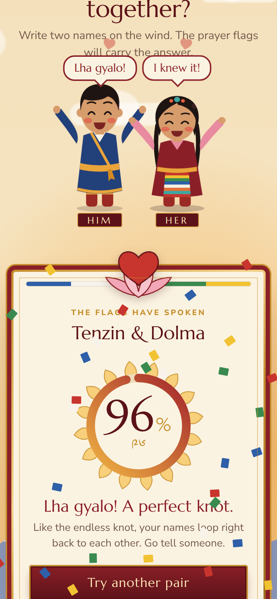

# tsewa བརྩེ་བ — a Tibetan love calculator

A playful, animated love calculator inspired by the classic pen-and-paper name game, dressed in Tibetan style.

**Website:** https://tenzin3.github.io/love_calculator/




## Web experience

- Prayer flags fluttering on a string, Himalayan peaks, and a sky that warms up or clouds over with the result.
- Two characters in traditional dress — him in a blue chuba with a saffron sash, her in a maroon chuba with a striped pangden apron, braids and turquoise.
- They react to the score in five ways: **85+** jump for joy with arms up and hearts, **65–84** hop and wave, **45–64** sway shyly and blush, **25–44** droop under a little cloud with a tear, **under 25** turn away crying in the rain while the lotus heart cracks in two.
- Their eyes follow your pointer while you wait, the one whose name you're typing leans in and blushes, and they nervously bounce while the score is calculated.
- The score fills a lotus ring and is also shown in Tibetan numerals; joyful scores send a burst of tiny prayer flags.
- Mobile layouts, keyboard access, screen-reader announcements, and reduced-motion support. Names never leave the device.
- No framework, build step, or backend.

## Run locally

```sh
python3 -m http.server 4173 --directory docs
```

Open http://localhost:4173. Serve files over HTTP rather than opening the HTML directly because the calculator uses JavaScript modules.

## GitHub Pages

The website lives in `docs/`. In repository **Settings → Pages**, select **Deploy from a branch**, then **main** and **/docs**. Changes pushed to this folder publish automatically.

## How the game works

The calculator counts unique characters in the two names with “love” between them, then repeatedly adds the outermost counts together. The final one or two numbers produce the score using the original game's rules. The web version ignores whitespace and case, normalizes Unicode, and splits large counts into individual digits so repeated names always produce a score between 0 and 99.

This is a game, not a measure or prediction of a relationship. Name order can affect the score.

## Original Python version

```sh
python3 main.py
```

Enter one name per line. The original command-line calculator is preserved.

## Calculation checks

```sh
node --test tests/calculator.test.mjs
```
